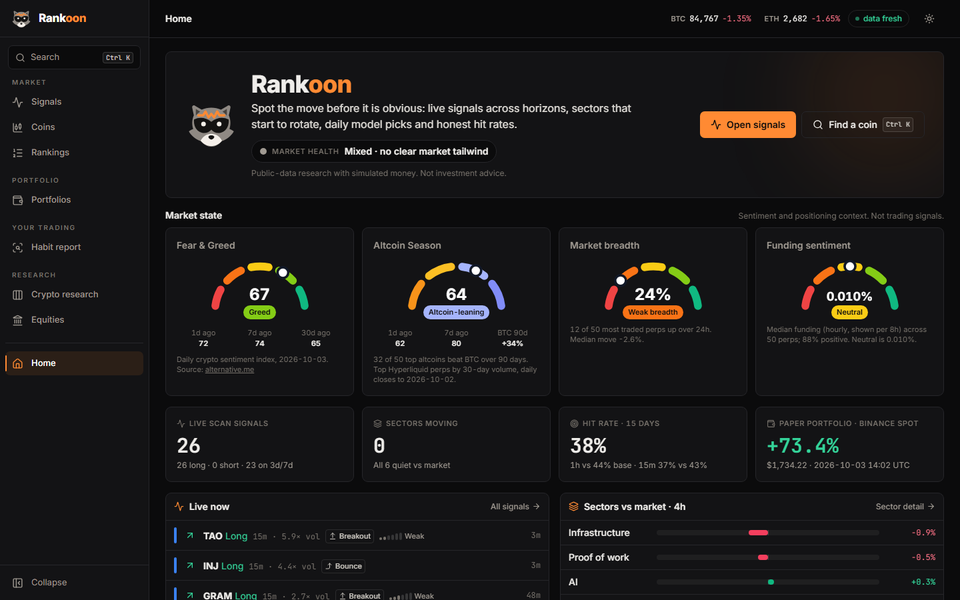
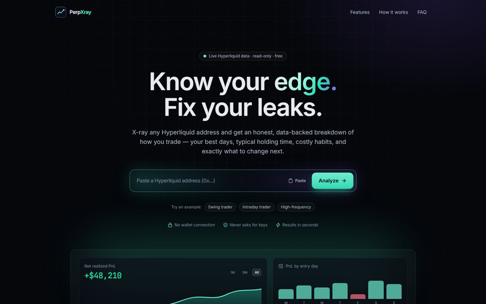
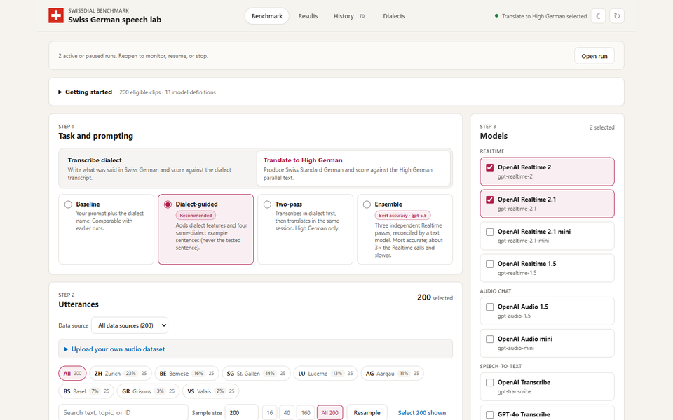
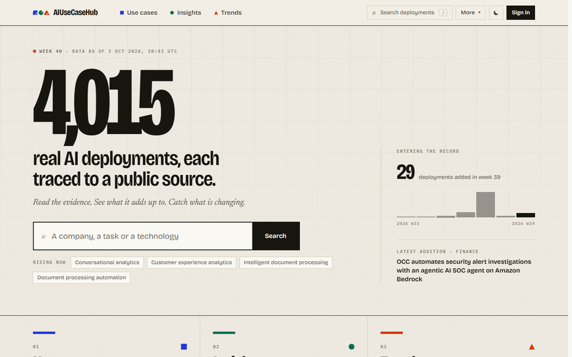
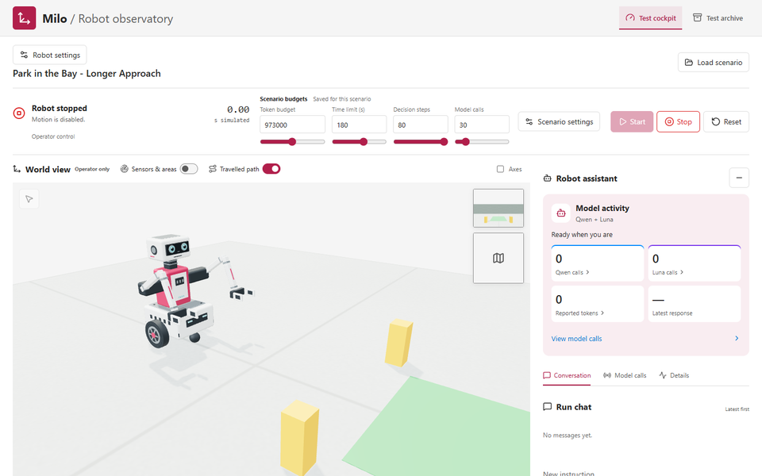
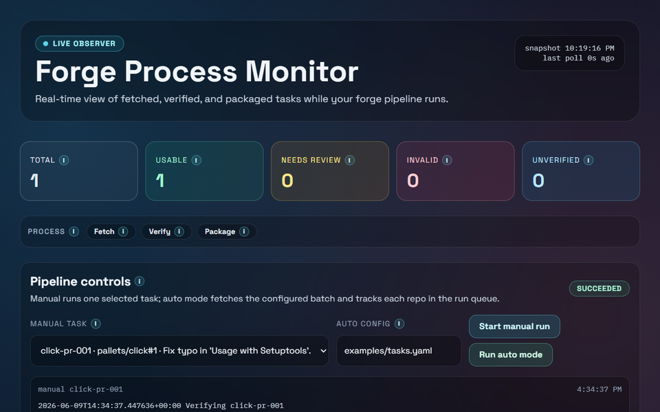

## Applied AI, built end to end

Applied AI architect and hands-on builder at Microsoft. I turn AI strategy into secure, operable systems.

I build agentic applications, evaluation tools, and data-driven products, with a focus on reproducible experiments and the engineering required to move from prototype to production.

[Portfolio](https://www.florianfollonier.com/) · [LinkedIn](https://www.linkedin.com/in/florian-follonier/) · [AIUseCaseHub](https://www.aiusecasehub.com/)

### Live products

| [Rankoon](https://rankoon.xyz/)                                                                                                                                           | [PerpXray](https://perpxray.xyz/)                                                                                                                                      |
|---------------------------------------------------------------------------------------------------------------------------------------------------------------------------|------------------------------------------------------------------------------------------------------------------------------------------------------------------------|
|  |  |
| Crypto signals, asset rankings, market research, and paper portfolios, backed by ML experiments and walk-forward validation.                                              | Read-only Hyperliquid trading analytics, from reconstructed positions to performance, trading behavior, and evidence-based insights.                                   |

Rankoon is public-data research with simulated money, not investment advice. PerpXray needs no wallet connection or trading permissions.

### Speech, agents, and robotics

| [Swiss German Voice Benchmark](https://github.com/flo7up/Swiss-german-transcription-test-bench)                                                                                                                                        | [AIUseCaseHub MCP](https://github.com/flo7up/aiusecasehub-mcp)                                                                                                                                              |
|----------------------------------------------------------------------------------------------------------------------------------------------------------------------------------------------------------------------------------------|-------------------------------------------------------------------------------------------------------------------------------------------------------------------------------------------------------------|
|  |  |
| Local-first dialect transcription and High German translation across eight SwissDial dialects, with WER, CER, chrF, transcript review, and streaming latency.                                                                          | Hosted MCP tools for source-linked enterprise AI research, with evidence retrieval, a free public preview, and an optional local stdio adapter.                                                             |

| [Milo: Embodied Robot Lab](https://github.com/flo7up/milo-agentic-robo-sim)                                                                                                                     | [SWE-RL Forge Lite](https://github.com/flo7up/swe-rl-forge-lite)                                                                                                                       |
|-------------------------------------------------------------------------------------------------------------------------------------------------------------------------------------------------|----------------------------------------------------------------------------------------------------------------------------------------------------------------------------------------|
|  |  |
| An in-progress 3D robotics simulator with an operator cockpit, agent-guided navigation experiments, sensor telemetry, and reproducible test scenarios.                                          | Real pull requests, Dockerized tests, executable rewards, and reproducible software tasks for coding-agent training and evaluation.                                                    |

### More open-source work

* [AI Web Scraping Pipeline](https://github.com/flo7up/ai-web-scraping-pipeline): Agentic discovery, structured extraction, grounded review, and deduplication on Azure. The pipeline behind [AIUseCaseHub](https://www.aiusecasehub.com/).
* [Relataly Python Tutorials](https://github.com/flo7up/relataly-public-python-tutorials): Practical machine-learning, deep-learning, time-series, and analytics notebooks, with accompanying tutorials on [Relataly](https://www.relataly.com/).

### What I work with

`AI agents` `MCP` `RAG` `Speech AI` `Embodied agents` `ML ranking`

`Python` `TypeScript` `Microsoft Foundry` `Azure` `Evaluation` `Observability`
